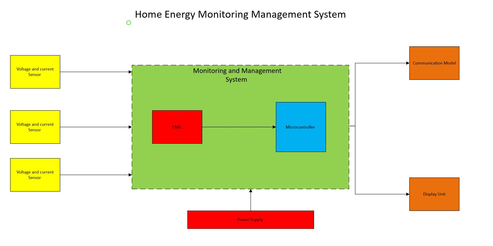

# Home-Energy-Monitoring-Management-System
We are developing a system capable of tracking every appliance in the home. The user will be able to acquire all appliance energy consumption parameters. The system can provide energy savings in homes and offices by automatically turning off loads when not in use.

## Project Schedule 
# Project Task Breakdown

## Milestone 1: 

### Items and Tasks
1. **Item 1: [Base Circuit]**
   - [ ] Task 1: [Requirements & Preliminary Design, Generate High-Level Block Diagram]
   - [ ] Task 2: [Create a simple circuit to simulate a system that reads and shows voltage changes]
   - [ ] Task 3: [Choose an ADC , Microcontroller, and other components for the base circuit model ]

3. **Item 2: [Base Circuit implementing the EMIC]**
   - [ ] Task 1: [Use an EMIC to get voltage, current, active power, apparent power, reactive power, power factor, and frequency]
   - [ ] Task 2: [Choose an input model to implement to the EMIC and test the circuit base  ]

---

## Milestone 2:

### Items and Tasks
1. **Item 1: [Power Management & efficiency]**
   - [ ] Task 1: [Create an Algorithm of a least two inputs to manage the power consumption of the system]
   - [ ] Task 2: [Research the use of a wifi or Bluetooth module to send information]

2. **Item 2: [Research of an element to send date from the desired appliance]**
   - [ ] Task 1: [Look for  a component to use to send data from the appliance to the meter system ]
   - [ ] Task 2: [Critical design Schematic Capture]

## Milestone 3:

### Items and Tasks
1. **Item 1: [PCB Manufacturing]**
   - [ ] Task 1: [PCB Layout]
   - [ ] Task 2: [Signal Analysis]

2. **Item 2: [Implementation]**
   - [ ] Task 1: [Assembly, Implementation, and Testing]
   - [ ] Task 2: [Conclusions]

# System High-Level Block Diagram

