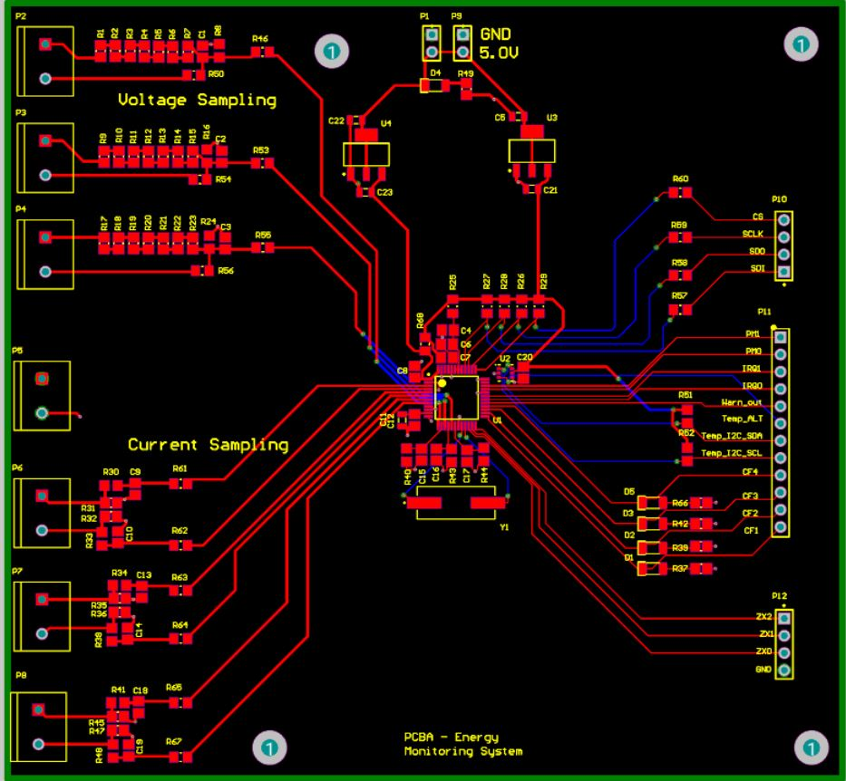
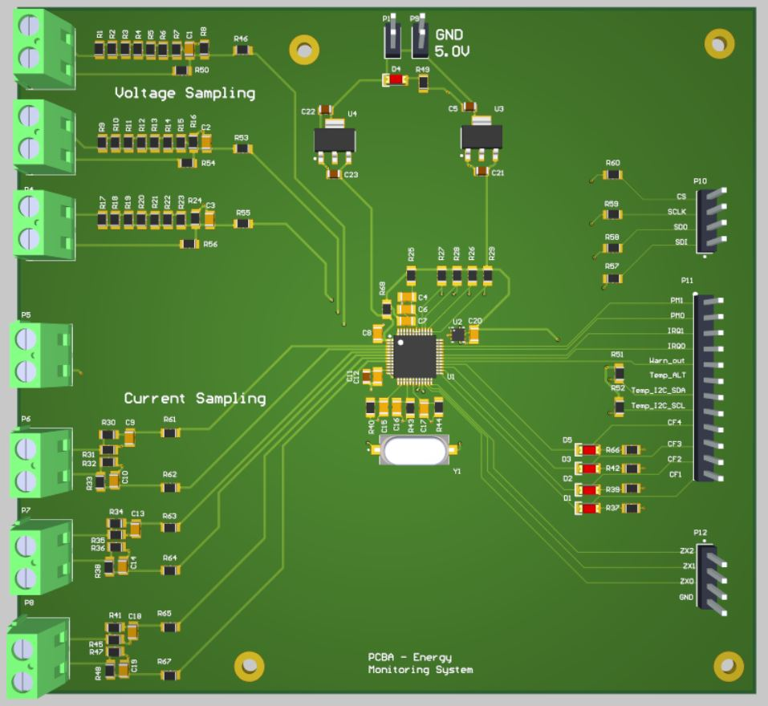
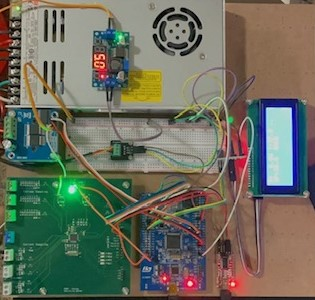
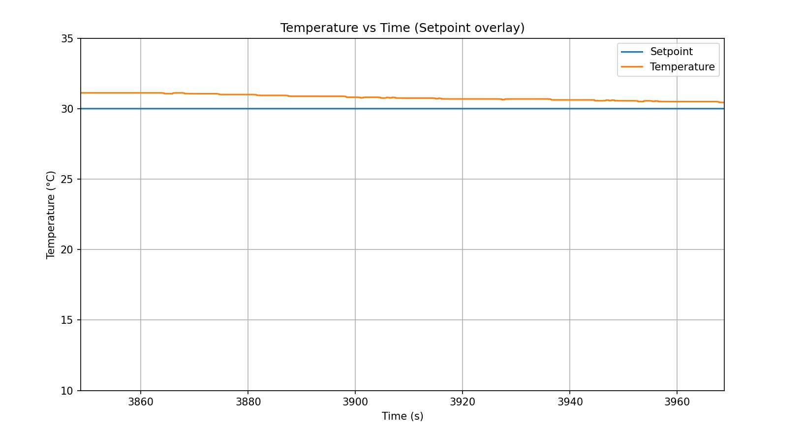
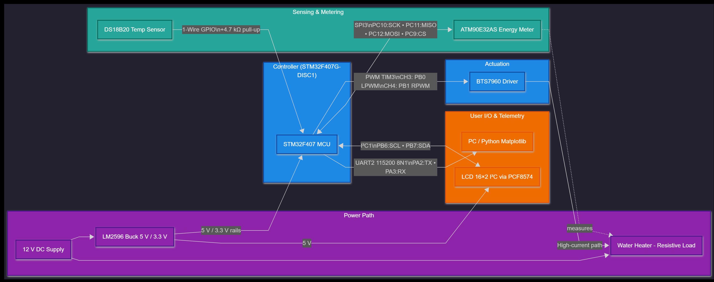
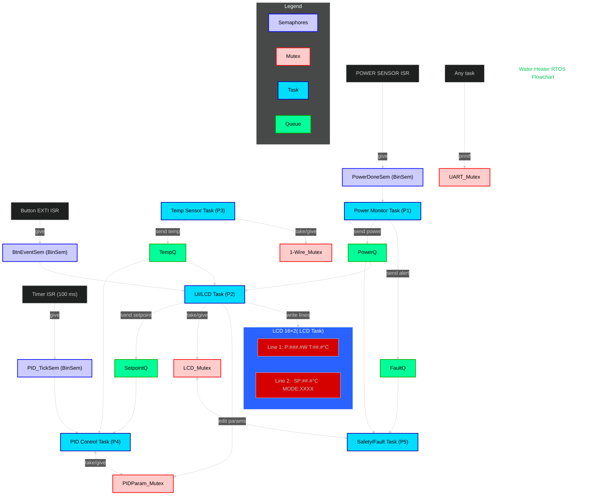

#  Water Heater Temperature Control System  
### Using STM32F407, FreeRTOS, PID Control, and ATM90E32AS Energy Meter

---

## Overview

This project implements a **closed-loop water heater temperature control system** using a **PID controller** under **FreeRTOS** on an **STM32F407G-DISC1** microcontroller, with a **BTS7960 PWM driver** for high-current heater control and an **ATM90E32AS poly-phase energy metering IC** (SPI) for real-time voltage, current, and power monitoring.


It uses:
- **STM32F407G-DISC1 microcontroller** as the main processing unit running FreeRTOS and coordinating all system tasks  
- **DS18B20 temperature sensor** for precise water temperature feedback  
- **BTS7960 43A motor driver** for high-current PWM heater control  
- **ATM90E32AS poly-phase energy metering IC** for accurate voltage, current, and power measurement via SPI  
- **I²C 16×2 LCD display** for real-time system information such as temperature, power, and control mode  
- **Python Matplotlib** for real-time data visualization over UART on a host PC  


The goal is to maintain stable heater performance, energy efficiency, and safety through modular firmware and real-time monitoring.

---

## System Images

| Description | Image |
|--------------|--------|
| PCB Atmel M90E32AS Power Monitor Schematic Overview |  |
| PCB Atmel M90E32AS Power Monitor Layout |  |
| PCB Atmel M90E32AS Power Monitor 3D |  |
| Water Heater Temperature Control Hardware Prototype Setup |  |
| Water Heater Temperature Control Live Data Visualization |  |
| Water Heater Temperature Control System Block Diagram |  |


---

## ⚙️ Features

- PID-based temperature control (tunable Kp, Ki, Kd)
- Modular **FreeRTOS** architecture with separate tasks for temperature, PID, UI, fault, and power monitoring
- Energy monitoring with **ATM90E32AS** over SPI
- Real-time UART telemetry for data logging and live plotting
- Calibration routines for voltage and current channels
- Safety layer for overcurrent and sensor fault handling
- Expandable Python GUI for monitoring and analysis

---

## System Architecture

---

##  Hardware Setup

| Component | Description |
|------------|--------------|
| MCU | STM32F407G-DISC1 |
| Driver | BTS7960 43A Dual H-Bridge Motor Driver |
| Sensor | DS18B20 temperature sensor (One Wire) |
| Energy Meter | ATM90E32AS (poly-phase metering IC, SPI3) |
| Power Supply | LM2596 buck + Mean Well LRS-350-12 |
| Display | 16×2 LCD via I²C  |
| Load | 12V resistive water heater element (~300W) |

---
**Connections**
- **PWM (Heater Control / BTS7960 Driver):**  
  - TIM3_CH3 → PB0 (LPWM)  
  - TIM3_CH4 → PB1 (RPWM)  
  - VCC (BTS7960 logic) → 5V  
  - GND → Common ground with STM32  
  - Motor output terminals → Heater load  

- **SPI3 (Energy Meter / ATM90E32AS):**  
  - PC10 → SCK  
  - PC11 → MISO  
  - PC12 → MOSI  
  - PC9  → CS (Chip Select)  

- **Temperature Sensor (DS18B20):**  
  - 1-Wire Data → e.g., PA8 (configurable GPIO input/output)  
  - 4.7 kΩ pull-up to 3.3 V  

- **LCD Display (I²C 16×2):**  
  - PB6 → SCL  
  - PB7 → SDA  
  - 5V and GND shared with STM32 board  

- **UART (Telemetry / Python Visualization):**  
  - USART2_TX → PA2  
  - USART2_RX → PA3  
  - Baud rate: 115200 bps, 8N1 configuration  

- **Power Supply:**  
  - 12 V DC input → LM2596 buck → 5 V and 3.3 V rails for logic  
  - Common GND between STM32, BTS7960, and ATM90E32AS
 


---

##  Firmware Modules

- **PWM / BTS7960 Driver**
  - Headers: `Core/Inc/bts7960_pwm.h`
  - Sources: `Core/Src/bts7960_pwm.c`

- **Energy Meter / ATM90E32AS**
  - Headers: `Core/Inc/atm90e32.h`
  - Sources: `Core/Src/atm90e32.c`

- **Temperature Sensor / DS18B20**
  - Headers: `Core/Inc/ds18b20.h`
  - Sources: `Core/Src/ds18b20.c`

- **LCD (I²C 16×2, PCF8574 Backpack)**
  - Headers: `Core/Inc/lcd_i2c.h`
  - Sources: `Core/Src/lcd_i2c.c`

- **PID Controller / Control Task**
  - Headers: `Core/Inc/pid_task.h`
  - Sources: `Core/Src/pid_task.c`

- **UART Telemetry / Serial Communication**
  - Headers: `Core/Inc/telemetry.h`
  - Sources: `Core/Src/telemetry.c`


### 🔹 RTOS Tasks
| Task | Function |
|------|-----------|
| `TempTask` | Reads DS18B20 temperature and queues it |
| `PIDTask` | Computes control output and sets PWM |
| `SafetyTask` | Handles overcurrent and fault events |
| `UITask` | Updates LCD or UART display |
| `PowerTask` | Reads ATM90E32AS power/voltage data |
---
## 🧵 RTOS Architecture (Mermaid)

The diagram below shows the communication between tasks, queues, semaphores, and mutexes in the system.  


---
### 🧮 PID Control — Detailed Overview

This project uses a discrete **PID controller** to regulate water temperature by modulating heater power (PWM duty on the BTS7960). The controller runs in its own FreeRTOS task and executes on a **fixed period** (default: 100 ms) triggered by `PID_TickSem` from a timer ISR.

#### Signals & Units
| Symbol | Source/Units | Description |
|---|---|---|
| `SP` | UI task → `SetpointQ` (°C) | Temperature setpoint entered by user / UI |
| `PV` | Temp task → `TempQ` (°C) | Measured temperature from DS18B20 |
| `e = SP − PV` | °C | Control error |
| `u_raw` | [%] | Unclamped PID output (0–100) |
| `u` | [%] | Saturated heater command (0–100), sent to PWM |
| `P,I,D` | terms | Proportional, Integral, Derivative contributions |

#### Timing
- **Sample period** `DT = 0.100 s` (100 ms) controlled by `PID_TickSem`.
- Keep *all* controller math synchronous with this tick to maintain stability.

#### Output Mapping
- `u` in **percent** → `BTS7960_SetHeaterPercent(u);`
- One-direction heating: CH3 (LPWM) drives duty, CH4 is held at 0%.

#### Anti-Windup & Derivative Filter
- **Integral clamping:** `I` only integrates when output is **not saturated** in the direction of error.
- **Derivative on measurement:** use `−Kd * (PV − PV_prev)/DT` to reduce noise amplification.
- Optional **first-order filter** for derivative: `D = α·D_prev + (1−α)·D_new`, with `α≈0.8–0.9`.

#### Safety Interlocks
- If Temp task posts a **sensor fault sentinel** (e.g., `PV < −999`), the PID task **forces heater OFF**.
- Safety/Fault task can override and zero PWM on overcurrent/overtemp events.

---

### 🧩 PID Task (pseudo-C, FreeRTOS style)

```c
// Called each 100 ms when PID_TickSem is given by TIM ISR.
void StartPIDTask(void *argument)
{
    const float DT = 0.100f;           // 100 ms
    // Gains (tune in UI or compile-time)
    volatile float Kp = 6.0f, Ki = 0.8f, Kd = 0.0f;

    // State
    float I = 0.0f;
    float pv_prev = 0.0f;
    float u = 0.0f;

    for (;;) {
        osSemaphoreAcquire(PID_TickSemHandle, osWaitForever);

        // 1) Read latest PV/SP (non-blocking)
        float pv = pv_prev, sp = 0.0f;
        (void)osMessageQueueGet(TempQHandle,     &pv, NULL, 0);
        (void)osMessageQueueGet(SetpointQHandle, &sp, NULL, 0);

        // Sensor fault sentinel from TempTask => heater OFF
        if (pv < -999.0f) {
            BTS7960_SetHeaterPercent(0.0f);
            continue;
        }

        // 2) PID terms
        float e  = sp - pv;                     // °C
        float P  = Kp * e;
        float D  = -Kd * (pv - pv_prev) / DT;   // derivative on measurement
        float u_raw = P + I + D;                // before clamping

        // 3) Saturate to 0..100%
        float u_sat = u_raw;
        if (u_sat < 0.0f)   u_sat = 0.0f;
        if (u_sat > 100.0f) u_sat = 100.0f;

        // 4) Anti-windup (integrate only when not fighting saturation)
        bool at_min = (u_sat <= 0.0f)   && (e < 0.0f);
        bool at_max = (u_sat >= 100.0f) && (e > 0.0f);
        if (!(at_min || at_max)) {
            I += Ki * e * DT;                     // integrate error
            // Optional clamp on I to keep it bound:
            if (I > 100.0f) I = 100.0f;
            if (I < -100.0f) I = -100.0f;
        }

        // 5) Command heater
        u = u_sat;
        BTS7960_SetHeaterPercent(u);

        // 6) Keep last PV for derivative
        pv_prev = pv;

        // Optional: update ATM90 auto-gain for PWM duty tracking
        // ATM90_AutoGainFromPWM(u / 100.0f, 0.03f, 0.10f);

        // 7) Telemetry for Python plot (CSV: t_ms,SP,PV,u,P,W)
        uint32_t t_ms = HAL_GetTick();
        float watts = ATM90_Read_P_W();
        // Format you already use: "t_ms,setpoint_c,temp_c"
        // You can extend with duty and power if desired:
        // Telemetry_Printf("%lu,%.2f,%.2f,%.1f,%.1f,%.1f\r\n", t_ms, sp, pv, u, P, watts);
    }
}


